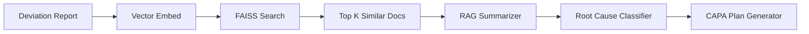

# capa_deviation_reasoning_agent
LLMS + RAG+ Agentic AI
Absolutely, Maryam. Below is a **polished, professional README** for your CAPA Reasoning Agent project that not only explains the technical implementation but also emphasizes design decisions, real-world relevance, and your ability to work with advanced AI concepts. It’s tailored to impress an interviewer—particularly one interested in AI, compliance, or industry use cases.

---

# 🧠 CAPA Reasoning Agent – AI-Powered Deviation Analysis

**A domain-aware, retrieval-augmented agent for analyzing pharmaceutical/biotech deviation reports and recommending structured CAPA (Corrective and Preventive Action) plans.**

 <!-- Optional image -->

---

## 🚀 Overview

This project showcases an **AI-powered agent** designed to:

* 📄 **Parse unstructured deviation reports**
* 🤖 **Summarize key incidents** using an LLM or distilled summarizer
* 🔍 **Classify root cause** with logic-based or model-backed rules
* 💡 **Generate CAPA suggestions** (Corrective + Preventive)
* 🔗 **Incorporate RAG** (Retrieval-Augmented Generation) to ground summaries in enterprise knowledge base

Built with:

* 🧠 HuggingFace Transformers (`facebook/bart-large-cnn`, `MiniLM`)
* 📚 FAISS + SentenceTransformers for semantic search
* 🧪 GxP-compliant domain logic
* 🌐 Streamlit for rapid prototyping

---

## ✨ Why This Matters

Deviation and CAPA handling is mission-critical in life sciences. Traditional systems rely on:

* Manual report parsing 📝
* Reactive CAPA suggestions ❌
* Lack of traceability across historical data 📉

This agent brings:

* 🔬 **AI-driven root cause reasoning**
* 🧠 **Summarization grounded in enterprise SOPs**
* ✅ **GMP/GxP contextual alignment**

It mimics how a **human quality analyst** thinks—with the speed and consistency of a machine.

---

## 🛠 Features

| Module               | Function                                               |
| -------------------- | ------------------------------------------------------ |
| `document_reader.py` | Reads uploaded deviation text                          |
| `capa_agent.py`      | Summarizes, classifies root cause, recommends CAPA     |
| `rag_index.py`       | Retrieves contextually relevant docs from vector store |
| `main.py`            | Streamlit app connecting all modules                   |

---

## 🧪 Example Workflow

1. **Upload deviation report** (`.txt`)
2. Model **summarizes** using BART or RAG
3. Agent **classifies root cause** (e.g., *Human Error*, *Mechanical Failure*)
4. Presents **Corrective + Preventive** action plan

---

## 🧠 RAG + Summarization Architecture



* SentenceTransformer: `all-MiniLM-L6-v2`
* Retriever returns SOPs or past deviations
* Summarizer generates context-aware summaries
* Classifier maps summary → root cause

---

## 📂 File Structure

```
CAPAAgenticAssistant/
│
├── data/                    # Sample deviations & SOP docs
├── tools/
│   ├── document_reader.py   # File parsing
│   ├── rag_index.py         # RAG retrieval logic
├── capa_agent.py            # Core summarization + CAPA engine
├── main.py                  # Streamlit app
├── requirements.txt
└── README.md
```

---

## 📦 Requirements

```bash
pip install -r requirements.txt
```

**Python ≥ 3.9 recommended** due to dependency constraints (especially for `safetensors`, `torch`, etc.)

---

## 🧠 Skills Demonstrated

* ✅ LLM Prompting + Pipeline Integration
* ✅ Summarization (with or without OpenAI)
* ✅ Embedding Search (FAISS, MiniLM)
* ✅ Agentic Reasoning (rule-based + model-aided)
* ✅ GxP/QMS Domain Familiarity
* ✅ Streamlit App Delivery (UI + UX)

---

## 💡 Future Enhancements

* Replace rule-based classification with fine-tuned `DeBERTa`
* Add feedback loop for human QA validation
* Deploy RAG model with **LangChain** + **local embedding server**
* Integrate versioned CAPA templates (XML/CSV outputs)

---

## 🧑‍💻 Maintainer

**Maryam Jameela**
AI Consultant |  ML

